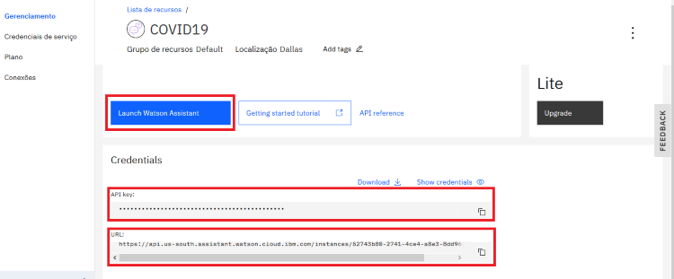
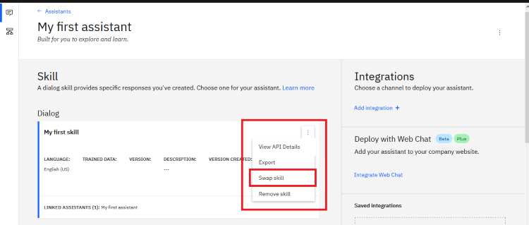
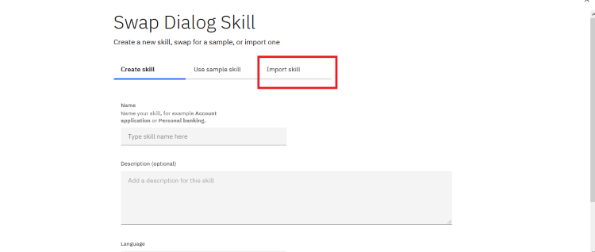
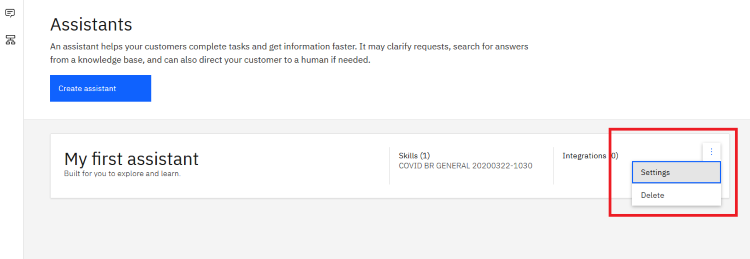
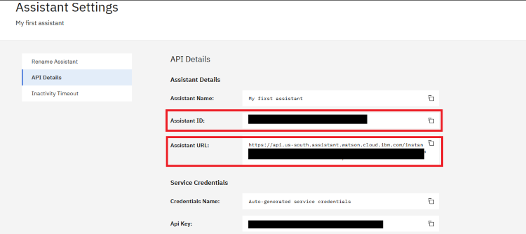
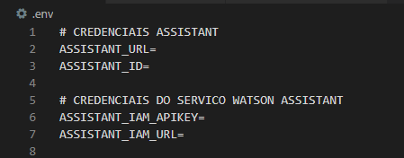

## Pré-requisitos

1. Baixar e instalar o [Node.js](https://nodejs.org/en/)
2. Criar uma conta na [IBM Cloud](https://cloud.ibm.com/registration/).
3. Baixar e instalar o [IBM Cloud CLI](https://cloud.ibm.com/docs/cli/index.html#overview).
4. Criar uma instância do serviço Watson Assistant e obtenha suas credenciais:
    - Acessar a página do [Watson Assistant](https://cloud.ibm.com/catalog/services/conversation) no catálogo da IBM Cloud.
    - Efetuar o login.
    - Clicar em  **Create**.
    
## Configurando a aplicação

1. Após efetuar o login na IBM Cloud, abra o serviço do Watson Assistant que você criou, copie as credenciais do serviço e clique em **Launch**.

    

2. Clique em **Swap Skill** nas configurações do assistente.

    

3. Clique na aba **Import Skill** e importe o arquivo **covid19-br.json** localizado neste projeto.

    

4. Após o carregamento do json, clique nas opção **Settings** do assistente e copie suas credenciais.

    

    

5. Cole as credenciais do item **1** e **5** dentro do arquivo **.env** em seu projeto.

    


## Testando localmente

1. Abra o terminal no diretório do projeto e instale as dependências.

    ```
    npm install
    ```

2. Execute a aplicação.

    ```
    npm start
    ```

3. Veja a aplicação em funcionamento no seu browser inserindo o endereço `localhost:3000`.

## Efetuando o deploy da aplicação no IBM Cloud utilizando Cloud Foundry

1. Abra o terminal e faça o login no [IBM Cloud CLI](https://cloud.ibm.com/docs/cli/index.html#overview).

    ```
    ibmcloud login
    ```

2. Defina a organização onde sua aplicação ficará hospedada.

    ```
    ibmcloud target --cf
    ```

3. Edite o arquivo *manifest.yml* e insira o nome da sua aplicação em **name**.  
  
    Exemplo: `- name: my-app-name`.

4. Realize o deploy

    ```
    ibmcloud app push
    ```

5. Veja sua aplicação em funcionamento clicando na url.  
    
    Exemplo: https://my-app-name.mybluemix.net


## License
This sample code is licensed under Apache 2.0.  
Full license text is available in [LICENSE](LICENSE).
